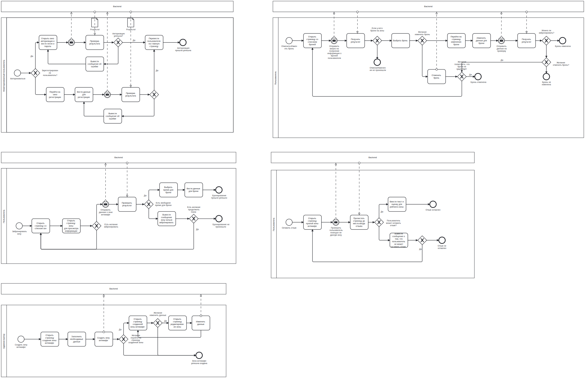
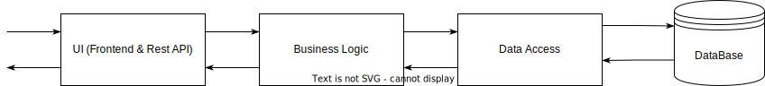
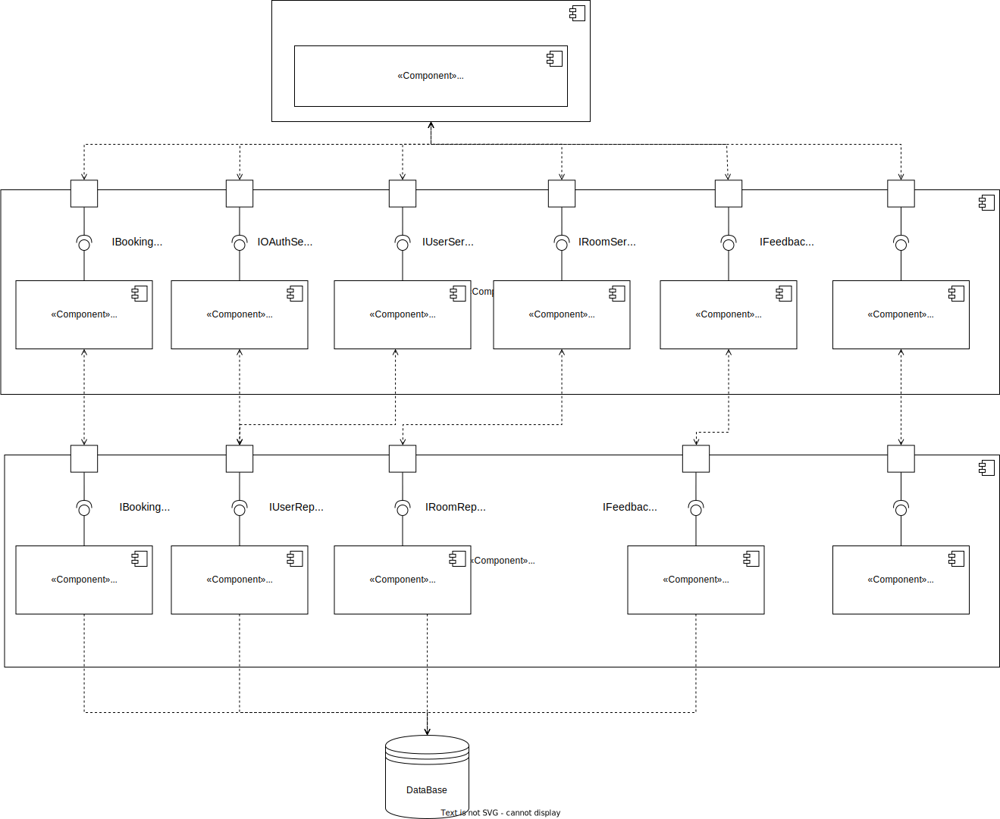
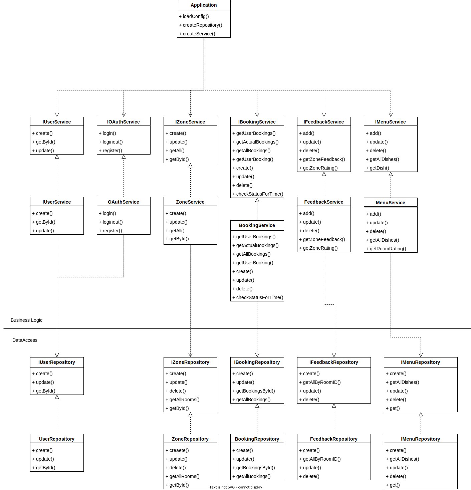

# Portal

### Название: **Сайт для бронирования мест в антикафе "Portal"**

## **Краткое описание идеи проекта**

Web-приложение, на котором будет располагаться информация для клиентов антикафе "Portal". 
Основная идея заключается в том, что клиент сможет бронировать комнаты и зоны в антикафе. Клиенты также способы оставлять отзыв с рейтингом о посещенных зон/комнат в антикафе. Администратор может отменить бронь клиента, создавть меню/зоны для антикафе.

## **Краткое описание предметной области**

Данное приложение предназначенно для бронирование клиетом зон/комнат в антикафе.

Предментная область включает в себя следующие сущности:

1. Комнаты (зоны/залы).
2. Пользователь.
3. Бронь (Бронирование).
4. Инвентарь.
5. Отзывы (хранение оставленных комментариев о комнате/зоне в антикафе)
6. Меню (Блюда).
7. Пакеты.

Роли:

1. Пользователь.
2. Клиент.
3. Администратор.

## **Краткое обоснование целесообразности и актуальности проекта**

Актуальность проекта заключается в необходимости удобного приложения для
антикафе. Компания людей всегда ищет чем же развлечься на выходных, чаще всего такие места бывают антикафе, парки развлечения и т.п., поэтому возникает необходимость информационной системы для антикафе: бронирования метс, просмотра меню, информации о выбранной комнате/зоне в антикафе. 

## **Краткий анализ аналогичных решений**

|Название|Бронирование|Просмотр меню|Рейтинг| 
|--------|----------|-------------|--------------|
|Time Club|+|-|-|
|SpeedRent|+|-|+|
|AntiCafe |+|+|-|
|Мой проект|+|+|+|

## **Use-Case**

### **ER-диаграмма сущностей**

### **Диаграмма базы данных**

### **Пользовательские сценарии**

Пользователь может зайти на сайт приложения и:
ц
1. Зайти на основую страницу.
2. Зайти на страницу со списком зон антикафе.
3. Зайти на страницу конкретной зоны антикафе.
4. Зайти на страницу меню антикафе.
5. Зайти на страницу регистрации, зарегестрироваться или перейти на страницу авторизации.
6. Зайти на страницу авторизации, авторизироваться или перейти на страницу регистрации.
7. Авторизоваться, зайти на страницу своего профиля.
8. Авторизоваться, зайти на страницу конкретной зоны антикафе и забронировать.
9. Авторизоваться, зайти на страницу конкретной зоны антикафе и отменить бронь.
10. Авторизоваться, зайти на страницу списка броней в личного профиле и отменить бронь на конкретную зону антикафе.
11. Авторизоваться, зайти на страницу зоны антикафе и оставить отзыв.
12. Авторизоваться и сделать что-то из предыдущих действий или ни одно из них, выйти из аккаунта.

## **Формализация бизнес-правил**

## **Технологический стек**
- Тип приложени: Web-SPA
- Backend: С#
- Frontend: React.js
- СУБД: PostgreSQL

**Примечание:** взаимодействие фронтенд и бэкенд частей приложения будет через Rest API.

## **Верхнеуровневое разбиение на компоненты**

Приложение будет состоять из 3 компонентов:
- Компонент реазации UI.
- Компонент реазации бизнес-логики (Business Logic).
- Компонент доступа к данным (Data Access).

### **Поток данных**

### **UML диаграмма компонентов**

## **UML диаграммы классов**

